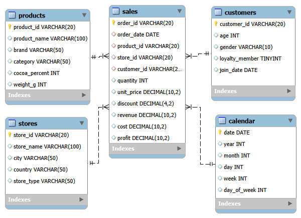

# 🍫 Chocolate Sales SQL Database Project

## Project Overview

This project demonstrates the process of designing and creating a relational database for analysing chocolate sales data using MySQL. The project includes database design, table creation, data exploration, and business analysis using SQL to identify trends in sales performance, products, customers, stores, and time periods.

The database was built from a sales dataset and organised into a relational schema consisting of dimension tables and a fact table to support efficient data analysis.

---

## Project Objectives

* Design and create a relational SQL database from a raw sales dataset
* Create tables with appropriate data types and relationships
* Implement primary and foreign keys to maintain data integrity
* Import data from CSV files
* Explore the dataset using SQL queries
* Build a foundation for business-focused sales analysis

---

## Database Design

The database consists of five related tables:

### Dimension Tables

* **Products** – product details, including brand, category, cocoa percentage and weight
* **Customers** – customer demographics and loyalty membership
* **Stores** – store information and location
* **Calendar** – date attributes for time-based analysis

### Fact Table

* **Sales** – transactional data including orders, products, customers, stores, quantities, revenue, costs and profit

Relationships between the tables are enforced using **primary keys** and **foreign keys** to ensure data consistency.

### Database Schema

---

## Project Components

The following stages have been completed:

- ✅ Created the database
- ✅ Designed and created relational tables
- ✅ Defined primary and foreign keys
- ✅ Imported data from CSV files
- ✅ Performed data exploration and quality checks
- ✅ Conducted sales performance analysis
- ✅ Conducted product performance analysis
- ✅ Conducted customer analysis
- ✅ Conducted store performance analysis
- ✅ Conducted time-based sales analysis
- ✅ Generated a database schema

---
## SQL Skills Demonstrated

- Database design and relational modelling
- Primary and foreign key implementation
- Data import and validation
- Data exploration and quality checks
- Multi-table joins
- Aggregate functions (`SUM`, `COUNT`, `AVG`)
- `GROUP BY` and `ORDER BY`
- `CASE` statements
- Business-focused sales analysis

---
## Tools & Technologies

* MySQL
* MySQL Workbench
* SQL
* Git & GitHub

---
## Key Insights

- Canada was the highest-performing market, generating more than £25K in revenue and outperforming all other countries in the dataset.
- Dark Chocolate 50% was the best-performing product, generating the highest revenue and profit among all products.
- Transactions made by non-loyalty customers accounted for 50.8% of total revenue, slightly exceeding the revenue generated by loyalty programme members.
- Male customers contributed 50.1% of total revenue, resulting in a marginally higher revenue contribution than female customers.
- Total revenue decreased slightly in 2024 compared to 2023, falling from £63.8K to £63.5K.
- May was the highest-performing month across the analysed period, generating the highest monthly revenue.
---
### Data Observations

- Product categories did not always align with chocolate types. For example, products containing "Dark Chocolate" appeared across multiple categories, including Praline and White. As a result, category-level analysis should be interpreted as product-family performance rather than chocolate-type performance.

- The analysis was performed on a reduced version of the original dataset and should be interpreted within the context of the available data.
## Dataset

The project uses a chocolate sales dataset containing information about products, customers, stores and sales transactions.
